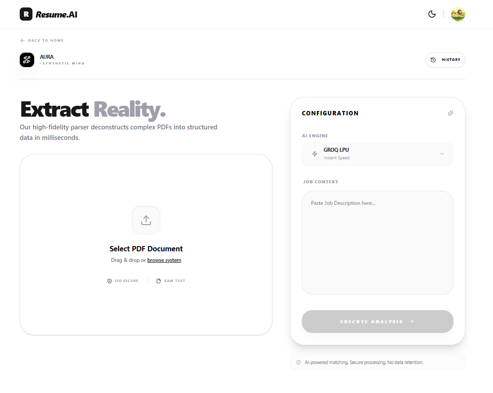
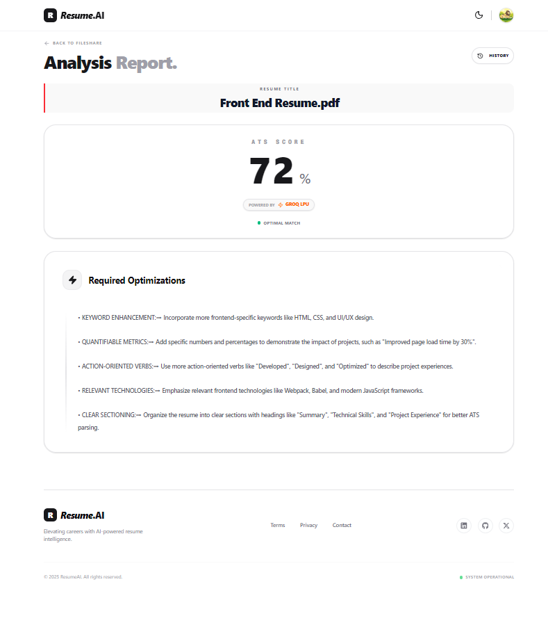
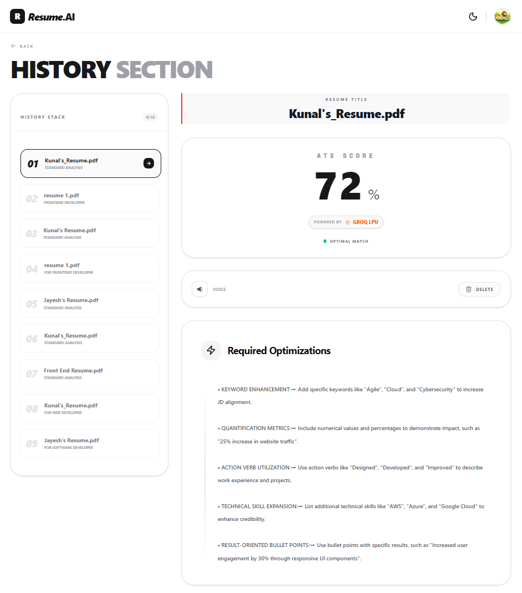

## 📸 Screenshots

<p align="center">
  
  
  
  
</p>

# Resume.ai

AI-Powered Resume Analysis & ATS Scoring Platform

Resume.ai is a modern web application that helps users analyze, optimize, and improve their resumes using AI-generated insights **along with an ATS (Applicant Tracking System) score**.  
The platform is designed to simulate how real recruiters and ATS systems evaluate resumes.

This project focuses on **real-world usability**, **clean frontend architecture**, and **professional UI/UX**, making it suitable for production-level applications and a strong frontend project.

---

## Features

### Authentication

- Secure user authentication using Supabase
- User-specific data isolation
- Protected routes and session handling

### Resume Management

- Create and manage multiple resumes
- Automatically remove older resumes to maintain limits
- Secure resume fetching per authenticated user

### AI Resume Analysis

- AI-powered resume feedback
- Structured suggestions for improvement
- Clear explanation of strengths
- Easy-to-understand insights for non-technical users

### ATS Score Evaluation

- Generates an **ATS compatibility score**
- Analyzes resume structure, keywords, and formatting
- Helps users understand how their resume performs in real hiring systems
- Actionable suggestions to improve ATS ranking

### Voice Feature

- Converts AI feedback into **spoken audio**
- Allows users to **listen to resume analysis**
- Improves accessibility and user experience

### UI / UX

- Clean, minimal, and modern interface
- Fully responsive for all screen sizes
- Dark and Light mode support

### Error Handling

- Custom toast notifications
- Friendly, user-readable error messages
- Proper loading, empty, and error states

---

## Tech Stack

### Frontend

- Next.js
- TypeScript
- Tailwind CSS
- Shadcn UI / Magic UI

### Backend & Services

- Supabase (Authentication & Database)
- AI API Integrations:
  - **Groq** — used for **fast responses and low-latency inference**
  - **Gemini** — used for **deep resume analysis and detailed insights**

---

## Project Structure

```bash
├── actions/
│   ├── gemini
│   ├── groq
│   └── refreshResumeData
├── app/
│   ├── (auth)/
│   ├── (main)/
│   ├── api/
│   ├── global.css
│   └── layout.tsx
├── components/
│   ├── home/
│   ├── ui/
│   ├── signin-form
│   ├── signup-form
│   └── theme-provider
├── context/
│   └── AuthProvider
├── hooks/
│   └── useAuth
├── lib/
│   ├── getPDFText
│   ├── supabaseClient.ts
│   └── utils.ts
├── public/
├── .env.local
└── README.md
```

## Author

Kunal Kumar Soni  
Frontend Developer (React / Next.js)

This project is actively evolving, with ongoing improvements focused on performance, usability, and real hiring use cases.
